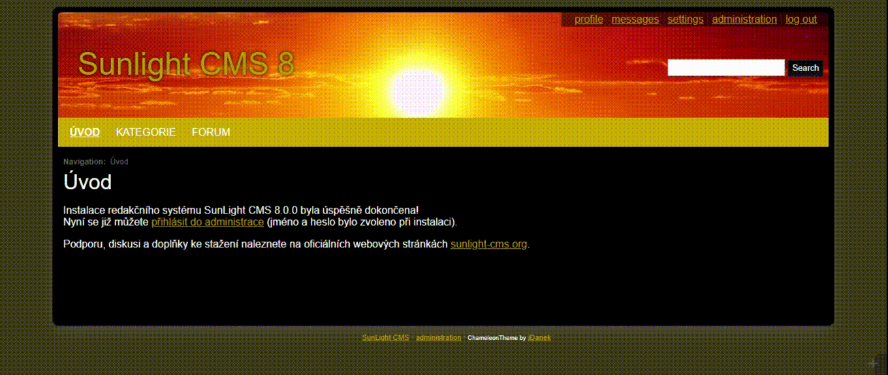

Chameleon Theme Template
########################

Customizable responsive multicolor theme with background patterns

.. contents::

Preview
*******

Requirements
************

- SunLight CMS 8

Installation
************

::

    Copy the folder 'plugins' and its contents to the root directory

or

::

    Installation via administration: 'Administration > Plugins > Upload new plugins'

Features
********

The theme in the basic version contains:

- 11 color schemes
- 50 patterns for the background
- 4 images for the header
- light and dark mode
- rounded corners for page
- side panel side selection option (left, right, both)

This makes it possible to combine a total of more than 8000 possible variants.

